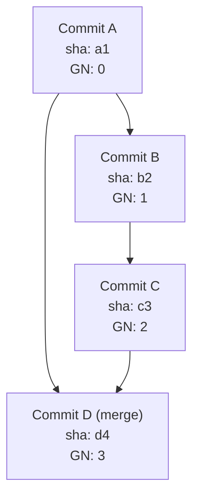

```mermaid
graph TD
  A["Commit A<br/>sha: a1<br/>GN: 0"]
  B["Commit B<br/>sha: b2<br/>GN: 1"]
  C["Commit C<br/>sha: c3<br/>GN: 2"]
  D["Commit D (merge)<br/>sha: d4<br/>GN: 3"]

  A --> B
  B --> C
  A --> D
  C --> D

```